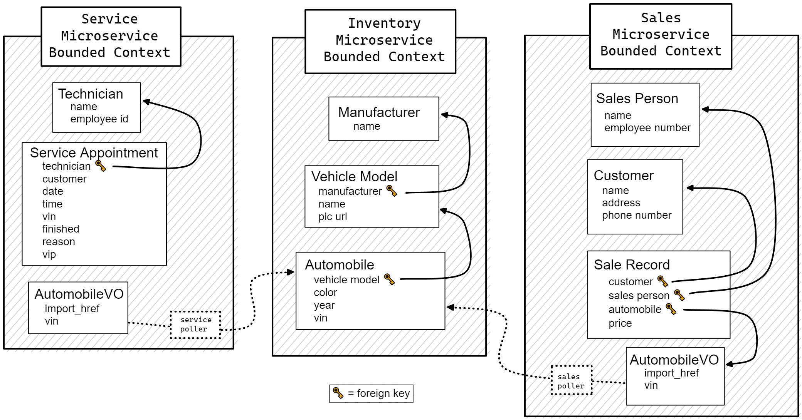

# CarCar

Team:

* Micheline Doughlin - Which microservice? - Service
* James Hoffman - Which microservice? - Sales

## Design

## Service microservice

Explain your models and integration with the inventory
microservice, here.

## Sales microservice

### `/sales/api/`

#### /sales_project/settings.py
Added that sales_rest app to the list of installed apps

#### /sales_project/urls.py
Added the base `api` path to urls of the project for rest api app

#### /common/json.py
Added functionally onto the included json encoder for a decimal encoder to encode the decimal data type used by SalesRecord model

#### /sales_rest/admin.py
Included admin views for all models for easier troubleshooting

#### /sales_rest/encoders.py
Isolated encoders to their own module

#### /sales_rest/models.py
Defined four models: `SalesPerson`, `SalesCustomer`, `SalesRecord`, `AutomobileVO`

`SalesPerson` model
| Field Name      | Type                 |
| --------------- | -------------------- |
| name            | CharField            |
| employee_number | PositiveIntegerField |

`SalesCustomer` model
| Field Name   | Type      |
| ------------ | ----------|
| name         | CharField |
| address      | TextField |
| phone_number | CharField |

`SalesRecord` model:
| Field Name   | Type                        |
| ------------ | --------------------------- |
| automobile   | ForeignKey to AutomobileVO  |
| sales_person | ForeignKey to SalesPerson   |
| customer     | ForeignKey to SalesCustomer |
| price        | CharField                   |

`AutomobileVO` is a value object that links outside the microservice to the inventory service
| Field Name  | Type      |
| ----------- | --------- |
| import_href | CharField |
| vin         | CharField |

#### /sales_rest/urls.py
The paths for the restful API mapped to the view functions

#### /sales_rest/views.py
Contains functions for handling different API requests

Functions:
* api_persons
    * handles requests via `/api/sales/staff/`
    * `GET` (list of all sales staff)
    * `POST` (adding new sales person)
* api_person
    * handles requests via `/api/sales/staff/<employee_id>`
    * `GET` (detail of a sales person)
    * `POST` (updating a sales person)
    * `DELETE` (deleting a sales person)

* api_customers
    * handles requests via `/api/sales/customers/`
    * `GET` (list of all customers)
    * `POST` (adding new customer)
* api_customer
    * handles requests via `/api/sales/customers/<customer_id>`
    * `GET` (detail of a customer)
    * `POST` (updating a customer)
    * `DELETE` (deleting a customer)

* api_records
    * handles requests via `/api/sales/records/`
        * `GET` (list of all sales records)
        * `POST` (adding new sales record)
    * handles requests via `/api/sales/staff/<employee_id>/records/`
        * `GET` (list of all sales records completed by a specific employee)
* api_record
    * handles requests via `/api/sales/records/<record_id>`
    * `GET` (detail of a sales record)
    * `POST` (updating a sales record)
    * `DELETE` (deleting a sales record)

### `/sales/poll/`

#### poller.py
Implemented logic for polling data from inventory microservice into LocationVO model

### `/ghi/app/src/sales/`

#### CustomerForm.js
A form to handle the submission of adding a new customer

Form inputs match model for SalesCustomer:
* Name
* Address
* Phone number

#### StaffForm.js
A form to handle the submission of adding a new sales person

Form inputs match model for SalesPerson:
* Name
* Employee number

#### RecordList.js
Displays a full list of all sales made

Information display for each sale:
* Sales person
* Customer
* VIN
* Sale price

#### RecordHistory.js
Displays a full list of all sales made by a specific employee that is chosen from a dropdown menu list of all employees

Information displayed for each sale:
* Sales person
* Customer
* VIN
* Sale price

#### RecordForm.js
A form to handle the submission of creating a new sales record

Form inputs match model for SalesRecord:
* Automobile (dropdown) (lists all unsold autos)
* Sales person (dropdown) (lists all sales staff)
* Customer (dropdown) (list all customers)
* Price
